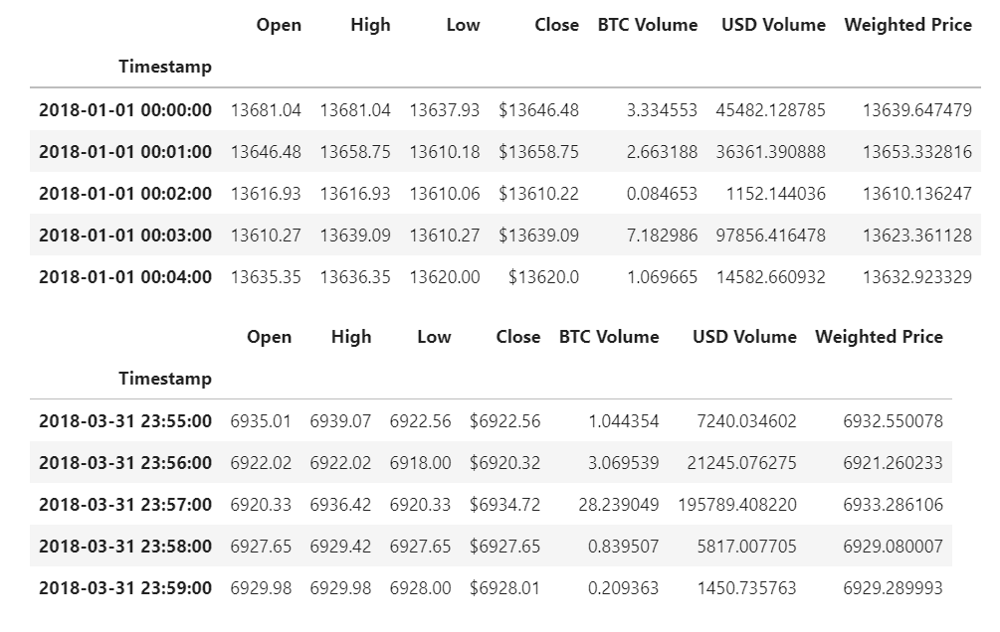
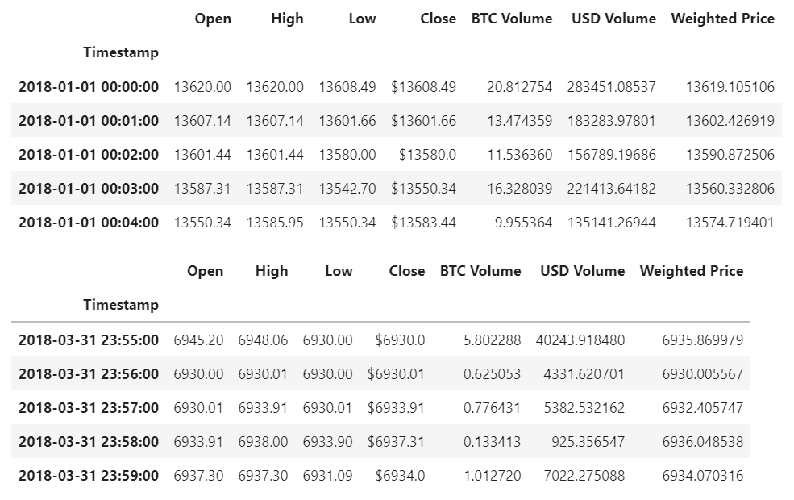

# Module_3_Challenge_Assignment - Bitstamp vs. Coinbase Arbitrage Analysis

---

## Description

This is a Jupyter Lab Notebook application that sorts through historical trade data for Bitcoin on two exchanges: Bitstamp and Coinbase.  
This application goes through the three main phases of data analysis: 

    1. Collect the data.

    2. Prepare the data.

    3. Analyze the data. 

This excercise focused on specific dates and timelines but can be modified to analyze any day in the datasets. 

### 1. Collect the Data:

Using the Pandas read_csv function and the Path module, we imported the data from bitstamp.csv and coinbase.csv file, and create a DataFrame called ```bitstamp``` and ```coinbase```, respectivley. We set the DatetimeIndex as the timestamp column.

Using the `.head()` and `.tail()` function we can view the first 5 and last 5 rows of the bitstamp dataset and see that it contains historical trade data from 2018-01-01 through 2018-03-31. 



Likewise, using the same technique for the coinbase dataset, we can see that it contains historical trade data from 2018-01-01 through 2018-03-31.



### 2. Prepare the Data

For the bitstamp and coinbase DataFrame's, the following was completed to properly clean the data for analysis: 

    -  Drop all NaN or missing values.
    -  Remove all "$" from the values.
    -  Convert data to 'floats' if not already done.  
    -  Remove any duplicated values from the dataset if applicable. 

### 3. Analyze the Data

To analyze the data in the bitstamp and coinbase DataFrames, we created a new dataframe with only the rows we wanted to focus on.  For this excercise, that row was the ```"Close"``` values.

Using Pandas, summary statistics and data plots were generated to get a overview understanding of the data.  With this overview, we were then able to focus our attention into specific dates to evaluate the opportunities for arbitrage investing ocurring early, middle and late in the dataset. 

The dates analyzed in this excersice were: 
```python
   early_date = '2018-01-16'
   middle_date = '2018-02-06'
   late_date = '2018-03-24'
```
The code is setup so that one can analyze other dates just by updating the ```early_date```, ```middle_date``` or ```late_date``` variable. 

Further analysis was completed to sum and plot arbitrage profits.  

In conclusion, after reviewing the the time periods early, middle and late in the the dataframe it can be determined that although there may have been opportunities to make a profit very early on in 2018, as time went on these opportunities siginificantly decreased.  From the days analyzed in this code from January, February and March, it was only the days in January and February that provided us with an opporutnity for profitable trades.  As time progressed through the dataset, the exchanges analyzed became efficient enough to start eliminating opportunity for arbitrage trading profit to be had.

---

## Technologies

This project leverages JupyterLab Version 3.0.14 in association with Anaconda distribution and the Conda package manager.  The following packages are also used: 

* [pandas](https://github.com/pandas-dev/pandas) - For the current source code hosted on GitHub.

---

## Installation Guide

The dependencies used are included when using Anaconda distribution and Conda package manager to manage the Python environment.  No additional installations are required.  

---

## Contributors

Joshua Creveling

Email: josh.creveling22@gmail.com

GitHub: https://github.com/joshuacreveling

LinkedIn: https://www.linkedin.com/in/joshua-creveling/

*Starter template provided by Trilogy Education Services*

---

## License

MIT
